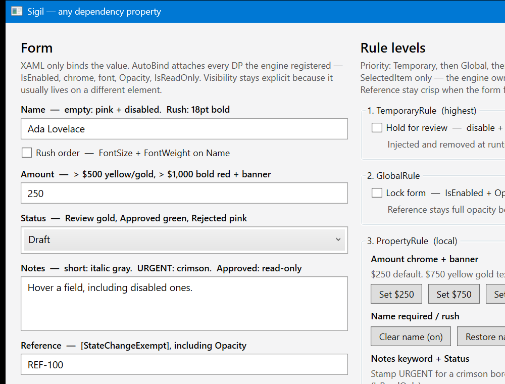

# Sigil.Wpf

One binding to rule them all.

A small WPF library that drives **any dependency property** from fluent view-model rules. XAML binds the value. The engine decides `IsEnabled`, `ToolTip`, `Background`, `Opacity`, `IsReadOnly`, and anything else you register.

This is **not** the [Sigil](https://www.nuget.org/packages/Sigil) IL-emitter package. The assembly and NuGet id are `Sigil.Wpf` so the two do not collide.

MIT licensed. See [LICENSE](LICENSE) and [CHANGELOG](CHANGELOG.md).



```xml
<Window xmlns:sigil="clr-namespace:Sigil.Wpf.AutoBinder;assembly=Sigil.Wpf"
        sigil:AutoBind.Enabled="True">
    <TextBox Text="{Binding Amount, UpdateSourceTrigger=PropertyChanged}" />
</Window>
```

```csharp
using System.Windows;
using System.Windows.Controls;
using System.Windows.Media;
using Sigil.Wpf;
using Sigil.Wpf.Engine;

public class InvoiceViewModel : SigilViewModel
{
    private int _amount;

    public InvoiceViewModel()
    {
        Engine.AddPropertyDefault(UIElement.IsEnabledProperty, true);
        Engine.AddPropertyDefault(Control.BackgroundProperty, SystemColors.WindowBrush);

        Engine.Add.Binding(Control.BackgroundProperty)
            .PropertyRule(() => Amount, _ => Amount > 500, Brushes.Yellow, RuleResult.FallThrough);
        Engine.Add.Binding(UIElement.IsEnabledProperty)
            .PropertyRule(() => Amount, _ => Amount > 1000, false, RuleResult.FallThrough, "Over the limit");
    }

    public int Amount
    {
        get { return _amount; }
        set
        {
            _amount = value;
            RaisePropertyChanged(nameof(Amount));
        }
    }
}
```

`SigilViewModel` owns the engine, the `[IsEnabled.Amount]` indexer, and `INotifyPropertyChanged`. `RaisePropertyChanged(nameof(Amount))` also raises `Item[]`, so setters do not call `NotifyIndexer()` themselves. Dispose the view model when the view goes away.

## Using your own view-model base

You cannot inherit both `SigilViewModel` and another framework base (`Screen`, `PropertyChangedBase`, …). Implement `ISigilViewModel` on *their* type, keep their base, and dispose the engine when the screen deactivates.

```csharp
using System.Threading;
using System.Threading.Tasks;
using System.Windows;
using Caliburn.Micro;
using Sigil.Wpf;
using Sigil.Wpf.Engine;
using Sigil.Wpf.Engine.Impl;

public class InvoiceScreen : Screen, ISigilViewModel
{
    public InvoiceScreen()
    {
        Engine = SigilEngine.Create(this);
        Engine.AddPropertyDefault(UIElement.IsEnabledProperty, true);
        Engine.Add.Binding(UIElement.IsEnabledProperty)
            .PropertyRule(() => Amount, _ => Amount > 1000, false, RuleResult.FallThrough);
    }

    public IRuleEngine Engine { get; set; }
    public object this[string key] => Engine.ApplyRulesTo(key);

    public void RaisePropertyChanged(string propertyName)
    {
        NotifyOfPropertyChange(propertyName);
        if (propertyName != "Item[]")
            NotifyOfPropertyChange("Item[]");
    }

    protected override Task OnDeactivateAsync(bool close, CancellationToken cancellationToken)
    {
        if (close)
            Engine.Dispose();
        return base.OnDeactivateAsync(close, cancellationToken);
    }
}
```

The library does not ship Caliburn types. See `Sigil.Wpf.Demo.Caliburn` for a single `Screen`, and `Sigil.Wpf.Demo.Shell` for a Conductor with tabs, a DataGrid, and dialogs (one engine per screen, disposed on close).

## Rule order

1. **TemporaryRule** — add and remove at runtime (`engine.Remove.TemporaryRule("hold")` deletes it)
2. **AllPropertiesRule** — every non-exempt property on this engine (this view model)
3. **PropertyRule** — one view-model property
4. **Default** — `AddPropertyDefault`

`[StateChangeExempt]` on a view-model property skips every rule. The default still applies.

Pass `RuleResult.FallThrough` as `resultIfNoMatch` to try the next rule. `null` is a real value (for example a cleared `ToolTip` or `Background`).

The match function receives the **property name** (`"Amount"`), not the value. Close over the view model: `_ => Amount > 1000`.

## Auto-bind

`AutoBind.Enabled="True"` on a window or panel walks controls that have a value binding (`Text`, `SelectedItem`, `Value`, …) and attaches `[IsEnabled.Amount]`, `[Background.Amount]`, and every other registered DP.

Layout properties such as `Visibility` are not auto-attached — bind those explicitly when they live on a different element (for example a warning banner).

Third-party controls work if they expose a normal WPF `Value` / `Text` / `SelectedItem` DP. The themed demo uses Material Design and MahApps.

A `DataGrid` row can be its own view model. Bind row chrome to a normal property (`IsEnabled="{Binding IsRowEnabled}"`) and put `AutoBind.Enabled="True"` on cell editors. If a rule disables the row when Status changes, refresh that property on the next dispatcher turn — disabling the row on the same turn cancels the DataGrid edit. Screen properties that the row closes over (a line amount limit, freeze Posted rows, lock) refresh cells when the screen raises `PropertyChanged`. Dispose a row when it leaves the collection so it unhooks the parent; dispose the screen when the window closes so remaining rows and engines go away. The demos show this: stock and themed rows inherit `SigilViewModel`; the Caliburn rows implement `ISigilViewModel` on `PropertyChangedBase`.

## Projects

| Project | What it is |
| --- | --- |
| `Sigil.Wpf` | Library (`net8.0-windows`; `net10.0-windows`; `net11.0-windows`) |
| `Sigil.Wpf.Tests` | NUnit tests (all three TFMs) |
| `Sigil.Wpf.Demo` | Stock WPF demo |
| `Sigil.Wpf.Demo.Themed` | Material Design + MahApps demo |
| `Sigil.Wpf.Demo.Caliburn` | Caliburn.Micro `Screen` + `ISigilViewModel` |
| `Sigil.Wpf.Demo.Shell` | Caliburn + Material/MahApps app shell (tabs, grid, dialogs) |

```powershell
dotnet test Sigil.Wpf.sln
dotnet run --project Sigil.Wpf.Demo
dotnet run --project Sigil.Wpf.Demo.Themed
dotnet run --project Sigil.Wpf.Demo.Caliburn
dotnet run --project Sigil.Wpf.Demo.Shell
```

## Requirements

- .NET 8, .NET 10, or .NET 11 Windows SDK
- WPF
